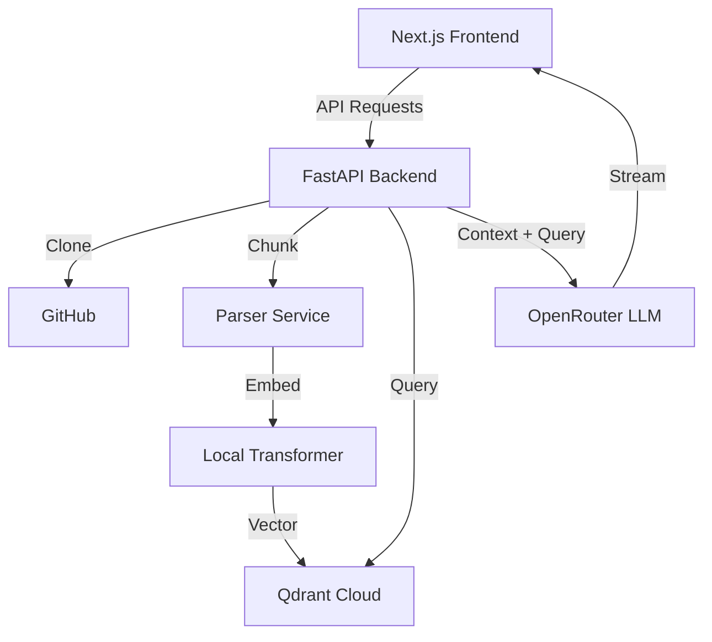

# CodeBase RAG 

A high-performance RAG (Retrieval-Augmented Generation) application designed for deep codebase analysis. Index your GitHub repositories, search them semantically, and chat with your code using the latest LLMs.


##  Features

- **GitHub Integration**: Instantly clone and index any public repository.
- **Semantic Code Search**: Powered by `sentence-transformers` for deep structural understanding.
- **Interactive Chat**: Streaming AI responses with real-time code references.
- **Production Ready**: 
  - **SQLite Persistence**: Your indexed repositories survive server restarts.
  - **Rate Limiting**: Integrated `SlowAPI` to prevent credit drainage.
  - **Windows Compatible**: Robust handling of read-only Git files.
- **Glassmorphism UI**: Premium dark-mode interface built with Next.js 15 and Tailwind v4.

##  Tech Stack

- **Frontend**: Next.js 15 (App Router), TypeScript, Tailwind CSS v4, Lucide React, Shadcn/UI.
- **Backend**: FastAPI, Python 3.10+, SQLModel (SQLite).
- **AI/ML**: 
  - **Embeddings**: Local `sentence-transformers` (all-MiniLM-L6-v2).
  - **Vector Store**: [Qdrant Cloud](https://qdrant.tech/).
  - **LLM**: OpenRouter (Claude-3 / GPT-4).

##  Getting Started

### Prerequisites

- Node.js 18+
- Python 3.10+
- [Qdrant Cloud](https://qdrant.tech/) Account (Free tier works great)
- [OpenRouter](https://openrouter.ai/) API Key

### Backend Setup

1. **Clone the repository**:
   ```bash
   git clone https://github.com/yourusername/codebase-rag.git
   cd codebase-rag
   ```

2. **Configure Environment**:
   Create a `.env` file in the root directory:
   ```ini
   OPENROUTER_API_KEY=your_key_here
   QDRANT_URL=your_qdrant_url
   QDRANT_API_KEY=your_qdrant_key
   ```

3. **Install Dependencies**:
   ```bash
   cd backend
   python -m venv venv
   .\venv\Scripts\activate # Windows
   pip install -r requirements.txt
   ```

4. **Start the Server**:
   ```bash
   # From the project root
   .\backend\venv\Scripts\python.exe -m uvicorn backend.main:app --host 0.0.0.0 --port 8000 --reload --reload-dir backend
   ```

### Frontend Setup

1. **Install Dependencies**:
   ```bash
   cd frontend
   npm install --legacy-peer-deps
   ```

2. **Run Development Server**:
   ```bash
   npm run dev
   ```

##  Architecture



##  Precautionary Measures (Agentic Best Practices)

- **Storage**: Moved from in-memory to SQLite to ensure data persistence across reboots.
- **Security**: Implemented `SlowAPI` to prevent API key abuse through rate-limiting.
- **Resource Management**: Large files (>1MB) are automatically skipped during parsing to optimize embedding costs.

##  License

Distributed under the MIT License.
